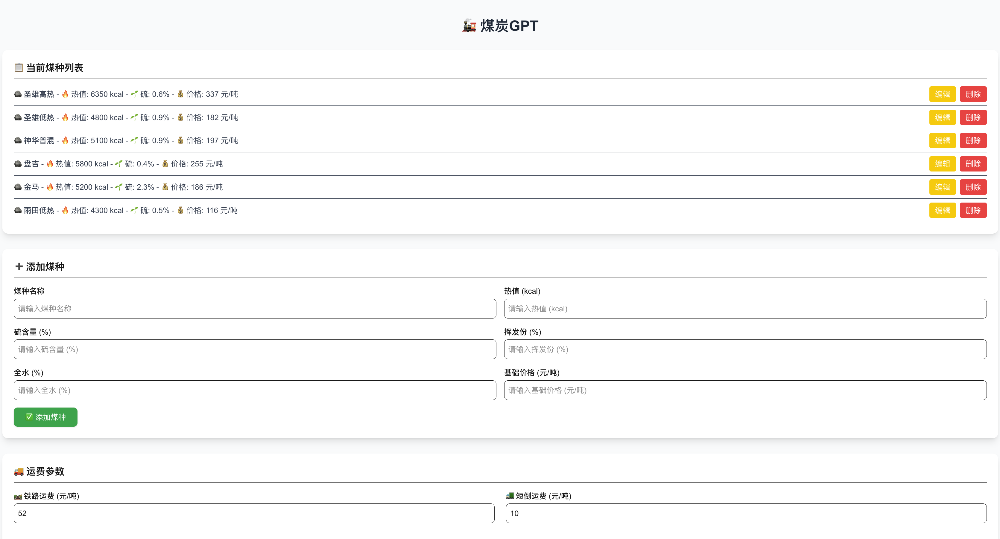
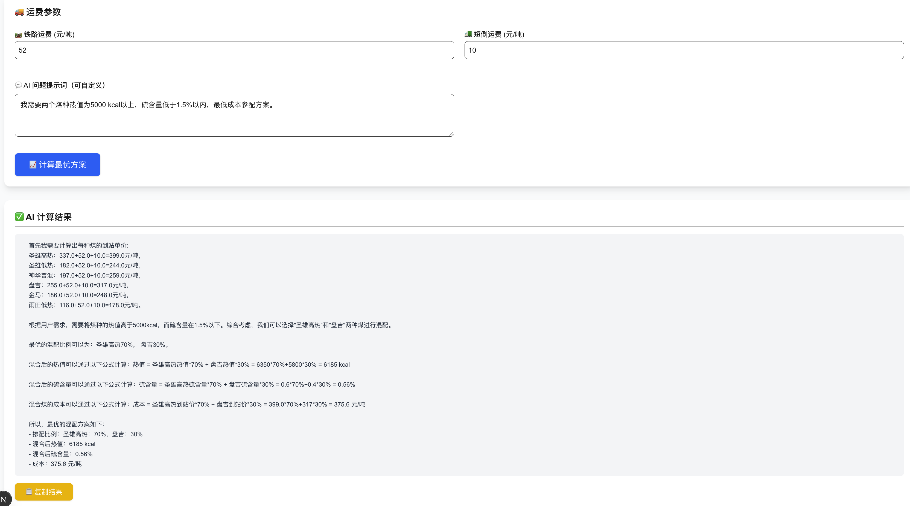

# coal-mvp

This is a experimental project that I worked with ChatGPT to build a Coal combination platform. By inserting the coal data and price, by calling the OPENAI behind the back to generate the best combination with lowest cost.

